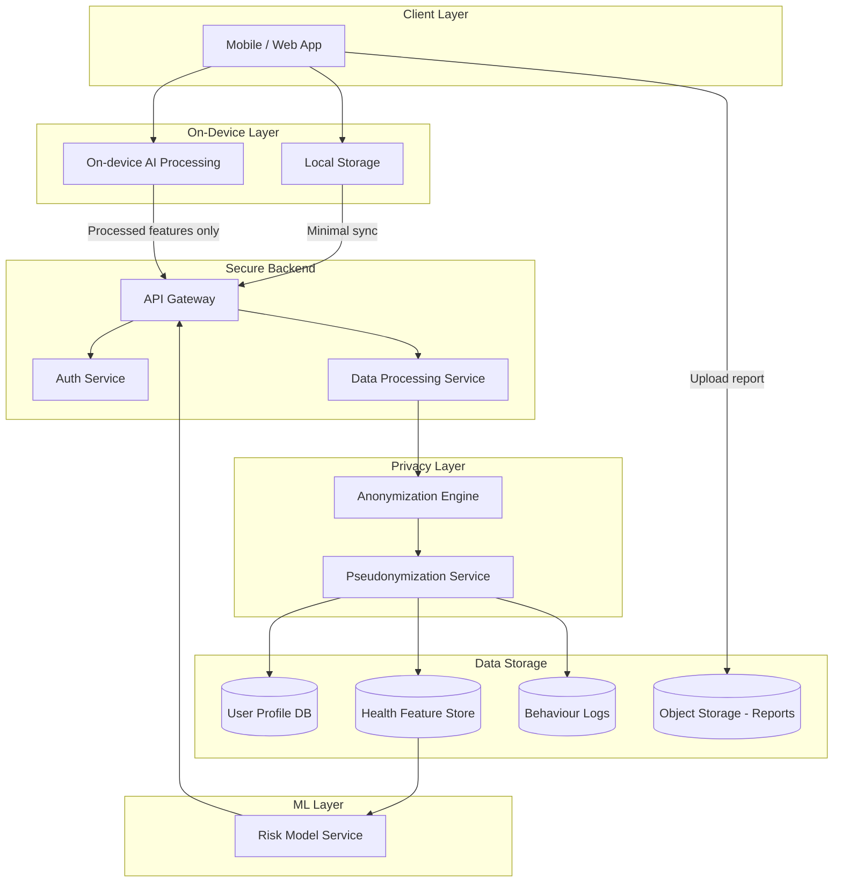
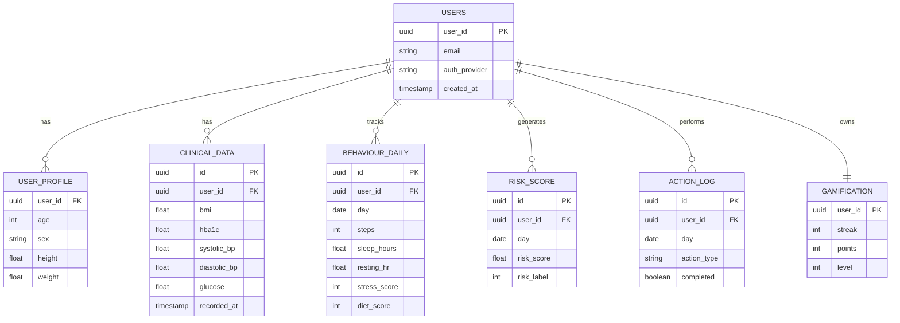
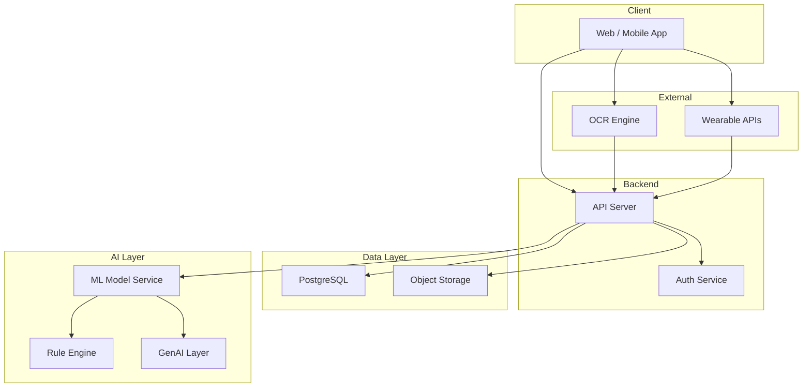
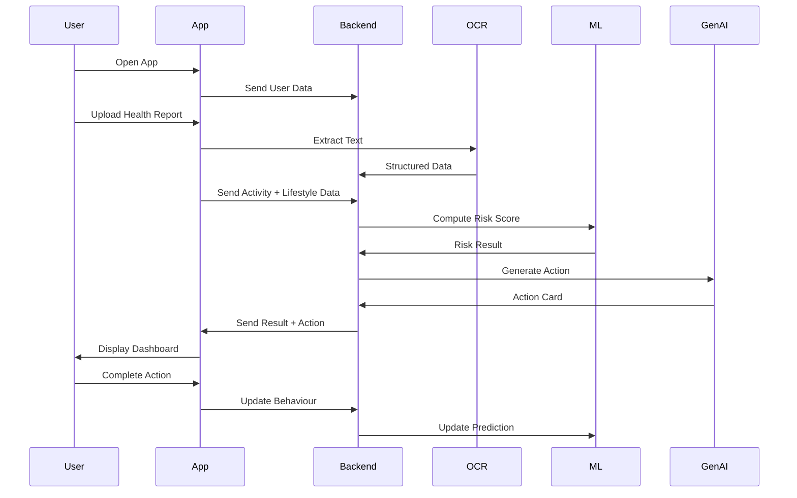
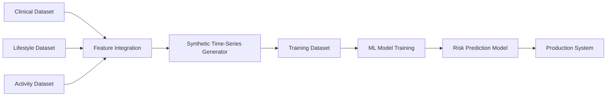

# SyncHealth Remission

## Mahidol x Harvard Health Systems Innovation Lab Hackathon 2026

### Problem

Chronic diseases such as diabetes and hypertension often develop silently over time, with few noticeable symptoms until complications appear. Although many people already have access to health-related data through wearables, smartphones, and annual health checkups, this data is often fragmented, difficult to interpret, and disconnected from daily decision-making.

As a result, users may collect activity and health data but still receive no meaningful, personalised, and timely intervention. The core gap is not the lack of data, but the lack of a system that translates data into actionable behaviour change before disease progression occurs.

#### Key pain points

- Chronic diseases develop gradually and are often detected too late.
- Health data is fragmented across checkups, apps, devices, and self-reports.
- Existing tools often provide passive tracking rather than personalised action.
- Users need daily, context-aware guidance, not just dashboards.

---

### Solution

**SyncHealth Remission** is a preventive health system that integrates activity data, lifestyle data, and clinical checkup data to predict early disease risk at the pre-disease stage and deliver personalised daily action recommendations.

The platform is designed to work for both:

- **Users with wearable devices**, who can provide high-resolution physiological and behavioural data.
- **Users without wearables**, who can still participate through smartphone sensors and self-reported patterns.

The goal is to shift from **passive tracking** to **proactive intervention**.

---

### Dataset Strategy

We use **feature-level integration** + **synthetic time-series generation**.

#### Datasets Used

1. Clinical Backbone
<https://www.kaggle.com/datasets/iammustafatz/diabetes-prediction-dataset>

2. Lifestyle Behaviour
<https://www.kaggle.com/datasets/mohankrishnathalla/diabetes-health-indicators-dataset>

3. Sleep & Stress
<https://www.kaggle.com/datasets/uom190346a/sleep-health-and-lifestyle-dataset>

4. Activity
<https://www.kaggle.com/datasets/monicahjones/steps-tracker-dataset>

#### How to synthesize data

Since most real-world datasets are cross-sectional (not time-series), we generate a synthetic longitudinal dataset to simulate user behaviour over time.

We follow a structured pipeline:

---

##### Step 1 — Sample baseline user profiles

- Sample users from the clinical dataset
- Each user has:
  - age
  - BMI
  - HbA1c
  - blood pressure
  - lifestyle indicators

We assign each user into an initial risk group:

- healthy
- borderline
- high-risk

---

##### Step 2 — Attach behavioural profiles

Using lifestyle + sleep datasets, we assign behaviour patterns:

- activity level (low / medium / high)
- sleep duration & quality
- stress level
- diet quality

This creates a **realistic baseline lifestyle context** for each user.

---

##### Step 3 — Generate time-series (7–30 days)

For each user, we simulate daily changes:

- steps fluctuate (±10–30%)
- sleep varies (±1–2 hours)
- stress changes based on pattern
- resting heart rate trends slightly shift

We introduce behaviour trends:

- improving (e.g. increasing steps)
- worsening (e.g. decreasing sleep)
- stable

---

##### Step 4 — Apply temporal dynamics

We simulate realistic health progression:

- prolonged inactivity → gradual risk increase
- poor sleep + high stress → compounding effect
- consistent healthy behaviour → risk reduction

This creates **trajectory-based signals**, not just static snapshots.

---

##### Step 5 — Compute daily risk score

For each user-day, we calculate a composite score:

- Clinical factors (high weight)
- Behavioural trends (moderate weight)
- Lifestyle context (supporting weight)

Example:

- HbA1c high → +3
- low steps trend → +1
- poor sleep → +1

---

##### Step 6 — Generate labels

We convert risk score into 3 classes:

- 0–2 → Stable
- 3–5 → Rising Risk
- 6+ → High Risk

Each row becomes:

→ one user-day with features + label

---

##### Step 7 — Output dataset

Final dataset format:

- user_id
- day_index
- clinical features
- behavioural features
- lifestyle features
- risk_score
- label

This produces a **synthetic but clinically-informed time-series dataset** for model training.

---

#### Key Insight

Instead of relying on perfect real-world longitudinal data (which is hard to access),

we simulate:

→ realistic behaviour patterns
→ short-term health trajectories
→ intervention-sensitive signals

This allows us to prototype **early disease prediction + daily intervention systems** within hackathon constraints.

### Data Store



#### Privacy Design Principles

- On-device first
  - raw data (images, detailed logs) processed locally where possible
- Feature-level upload only
  - backend receives derived features, not raw sensitive data
- Pseudonymization
  - user identity separated from health data
- Data minimisation
  - only store what is needed for prediction
- Future-ready
  - compatible with PDPA / HIPAA concepts

#### Database Design



#### Dataset Schema

| Field | Type | Description |
|------|------|------------|
| user_id | string | anonymised user identifier |
| day_index | int | day in time-series |
| age | int | user age |
| sex | string | male/female |
| bmi | float | body mass index |
| hba1c | float | blood sugar indicator |
| systolic_bp | float | systolic blood pressure |
| diastolic_bp | float | diastolic blood pressure |
| resting_hr | float | resting heart rate |
| sleep_hours | float | hours of sleep |
| steps | int | daily step count |
| stress_score | int | stress level (1–10) |
| diet_score | int | diet quality (1–10) |
| wearable_flag | boolean | wearable vs phone user |
| risk_score | float | computed risk (0–1) |
| label | int | 0=stable,1=rising,2=high |

### Core AI

#### Prototype

- Logistic Regression / XGBoost
- Rule-based clinical scoring

#### Future

- Temporal model (LSTM / Transformer)
- Personalised recommendation ranking

### Tech Stack

#### Prototype Phase (Hackathon)

- Frontend: Next.js + Tailwind
- Backend: Node.js + FastAPI
- DB: PostgreSQL / Supabase
- ML: scikit-learn
- OCR: Google ML Kit

#### Production Phase (Future - Native App)

- Mobile: Swift/Kotlin (native)
- Backend: Microservices (Node + Python)
- Infra: AWS / GCP
- ML: Model serving (FastAPI + MLflow)
- On-device AI: Core ML / TensorFlow Lite

---

### Features

#### Core Features

- Risk prediction (pre-disease)
- Daily action cards
- Health report OCR
- Behaviour tracking

#### Advanced Features

- Personalised intervention ranking
- Adaptive habit system
- Explainable AI (why risk changed)

#### Gamification

- streaks
- leaderboard
- team challenge
- recovery badge

#### Future Features

- doctor dashboard
- insurance integration
- digital twin health model

---

### Architecture



#### High-Level Architecture

1. **Client Layer**
   - mobile app / web app
   - wearable integrations
   - report upload UI
   - daily check-in UI

2. **Data Ingestion Layer**
   - wearable API ingestion
   - smartphone sensor collection
   - survey submission
   - OCR pipeline for lab reports

3. **Data Processing Layer**
   - field normalization
   - missing-value handling
   - feature engineering
   - time-series aggregation

4. **Prediction Layer**
   - rule-based clinical scoring
   - tabular ML model
   - risk classification

5. **Recommendation Layer**
   - personalised action generation
   - GenAI explanation layer
   - adherence-aware adjustment

6. **Gamification Layer**
   - streak tracking
   - challenge engine
   - leaderboard service

7. **Storage and Analytics Layer**
   - user profile store
   - health feature store
   - recommendation history
   - adherence logs

### Sequence Diagram



### Data Pipeline



### Implementation Plan (26 March – 3 April)

#### Phase 0 (26 Mar)

- Finalise scope (prediabetes focus)
- Lock dataset + schema
- Define risk logic

---

#### Phase 1 (27 Mar)

- Generate synthetic dataset
- Build risk scoring function

---

#### Phase 2 (28 Mar)

- Train simple ML model
- Output: risk score + label

---

#### Phase 3 (29 Mar)

- Backend API (FastAPI)
- Endpoints:
  - /predict
  - /upload
  - /action

---

#### Phase 4 (30 Mar)

- Frontend:
  - onboarding
  - dashboard
  - action card

---

#### Phase 5 (31 Mar)

- OCR integration (or mock)
- Data normalization

---

#### Phase 6 (1 Apr)

- Gamification:
  - streak
  - completion

---

#### Phase 7 (2 Apr)

- Connect end-to-end flow
- Prepare demo scenario

---

#### Phase 8 (3 Apr - Hackathon Day)

- Polish demo (<30 sec flow)
- Prepare pitch

---

## Folder Structure

```txt
synchealth-remission/
│
├── README.md
├── docs/                # pitch, diagrams, architecture
├── data/                # dataset schema / sample (NO sensitive data)
├── notebooks/           # ML experiments
├── backend/             # API (FastAPI / Node)
├── frontend/            # web or app
├── models/              # trained models / pipelines
├── infra/               # deployment / docker
├── scripts/             # data processing
└── tests/
```

## Branch Rule

```txt
main        → production-ready (demo day)
dev         → integration branch
feature/*→ new features
fix/*       → bug fixes
hotfix/*    → urgent fixes (demo-critical)
```
