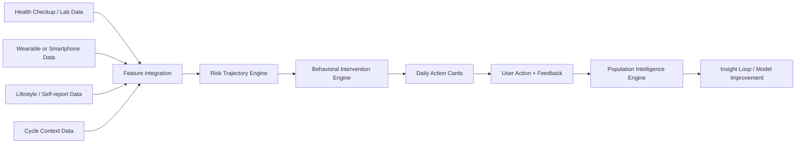
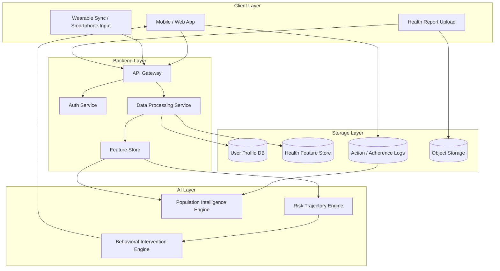
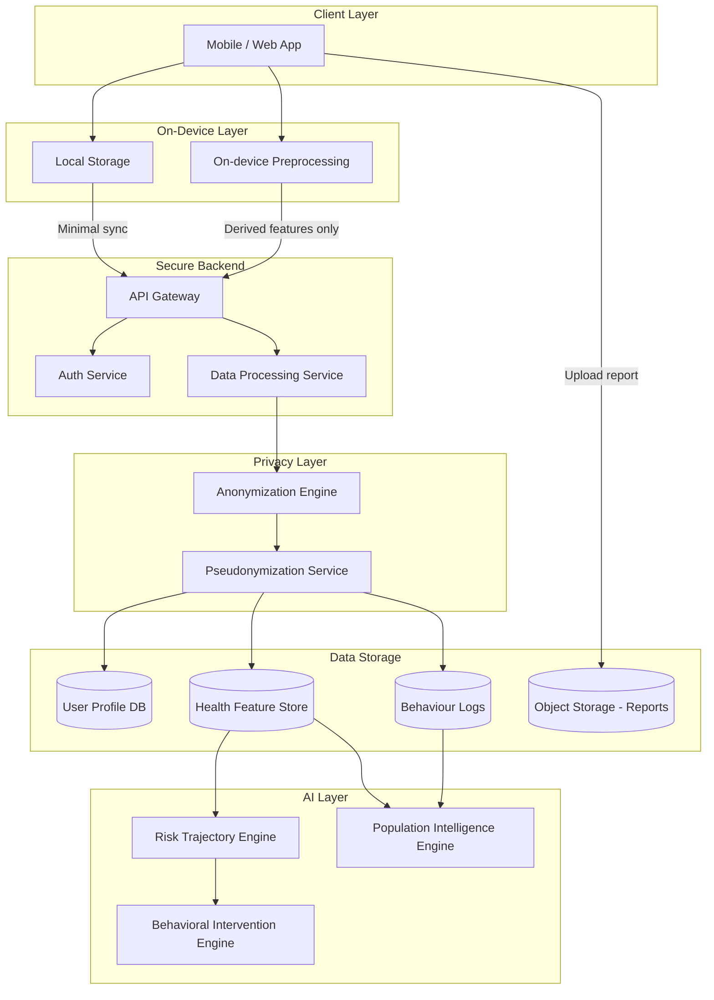
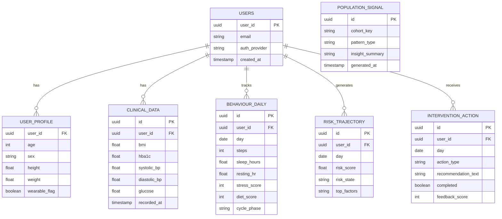
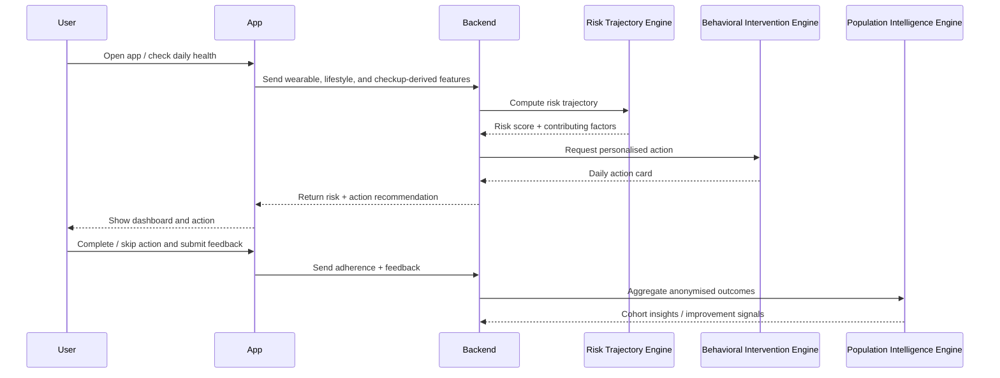
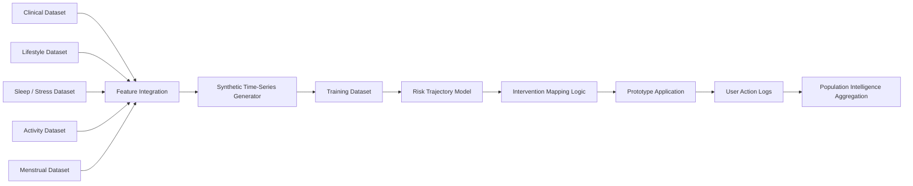

# SyncHealth Remission

## Mahidol x Harvard Health Systems Innovation Lab Hackathon 2026

SyncHealth Remission is a preventive health intelligence system that turns fragmented health data into early risk detection and personalised daily intervention.

Our prototype is built around a **3-layer AI architecture** inspired by Yanew’s direction:

1. **Risk Trajectory Engine**  
   predicts whether a user is moving toward diabetes risk based on clinical + behavioural patterns over time

2. **Behavioral Intervention Engine**  
   converts risk signals into personalised, context-aware daily action cards

3. **Population Intelligence Engine**  
   learns from anonymised user behaviour and intervention outcomes to improve recommendations, identify population patterns, and inform future health system insights

In the **initial phase**, we focus on **diabetes / prediabetes risk prediction**.  
In later phases, the platform can expand to broader **cardiometabolic risk**, such as hypertension, dyslipidemia, and metabolic syndrome.

---

## 1. Problem

Chronic conditions such as diabetes often progress silently for years before formal diagnosis. Even when people already have access to annual health checkups, smartphone data, or wearable data, the information is usually fragmented across different systems and rarely translated into practical daily guidance.

As a result:

- users may track their behaviour without understanding whether they are moving toward disease
- current apps often stop at dashboards, scores, or passive monitoring
- intervention is often late, generic, or disconnected from real-world routines
- female users may receive less accurate recommendations when physiological changes such as menstrual cycle variation are ignored

### Key pain points

- Diabetes risk develops gradually and is often detected too late
- Health data is fragmented across checkups, apps, devices, and self-reports
- Existing tools often provide passive tracking rather than timely intervention
- Users need daily, context-aware guidance, not just retrospective summaries
- Population-level learning is often missing from consumer prevention tools

---

## 2. Solution

**SyncHealth Remission** is a preventive AI system that combines:

- annual health check / lab data
- activity and lifestyle behaviour
- sleep and stress patterns
- wearable or smartphone-derived daily signals
- female-specific cycle context when applicable

The system moves from **passive tracking** to **proactive remission-oriented intervention** through a 3-layer architecture.

### 2.1 Three-Layer AI Architecture

#### Layer 1 — Risk Trajectory Engine

This engine estimates how a user’s health risk is evolving over time instead of only giving a one-time static score.

It uses:

- clinical baseline features such as BMI, glucose-related indicators, blood pressure
- behavioural trends such as steps, sleep, stress, and diet proxies
- temporal change patterns across days
- female-specific physiological context such as cycle phase

**Output:**

- stable / improving / rising-risk trajectory
- diabetes risk score
- explainable contributing factors

#### Layer 2 — Behavioral Intervention Engine

This engine converts the risk signal into **personalised action recommendations** that fit the user’s routine and health context.

Examples:

- suggest a short walk after lunch if post-meal risk pattern is worsening
- encourage earlier sleep when sleep debt is compounding risk
- reduce intensity or change timing of actions based on fatigue or cycle phase
- recommend achievable daily goals instead of generic targets

**Output:**

- daily action cards
- nudges and reminders
- adherence-aware next-best actions
- personalised micro-goals

#### Layer 3 — Population Intelligence Engine

This engine learns from anonymised user behaviour and outcomes across the system.

It helps answer questions like:

- which intervention patterns work best for which user groups?
- what behaviours most commonly precede rising diabetes risk?
- what types of nudges improve adherence in similar users?
- what trends should be surfaced to public health or partner organisations?

**Output:**

- feedback loop for improving recommendation quality
- cohort-level insights
- intervention effectiveness patterns
- future-ready health system intelligence

---

## 3. Why this approach matters

Most prevention tools either:

- track behaviour without prediction, or
- predict risk without guiding sustainable behaviour change

SyncHealth Remission connects both, then closes the loop with population learning:

**Data → Risk Trajectory → Personalised Intervention → User Feedback → Population Learning**

This makes the solution stronger both for **individual prevention** and for **future health system value**.

---

## 4. Initial Scope

### Prototype scope for hackathon

We focus on:

- **diabetes / prediabetes risk**
- short-horizon risk trajectory
- daily behaviour guidance
- explainable prototype flow
- lightweight feedback loop

### Future expansion

After validating the prototype, the system can be expanded to:

- hypertension risk support
- metabolic syndrome monitoring
- dyslipidemia-related behaviour guidance
- broader cardiometabolic prevention pathways
- wearable devices support

---

## 5. Target Users

### Primary users

- adults at risk of diabetes or prediabetes
- people with annual health checkup results but limited interpretation
- users already using wearables or health apps
- users without wearables who can still participate via smartphone and self-report

### Secondary stakeholders

- preventive health programs
- hospitals and wellness clinics
- insurers or employers running health promotion programs
- public health partners interested in anonymised population trends

---

## 6. Dataset Strategy

We use **feature-level integration** plus **synthetic time-series generation** to simulate realistic day-to-day health trajectories.

### Datasets Used

1. **Clinical Backbone**  
   <https://www.kaggle.com/datasets/iammustafatz/diabetes-prediction-dataset>

2. **Lifestyle Behaviour**  
   <https://www.kaggle.com/datasets/mohankrishnathalla/diabetes-health-indicators-dataset>

3. **Sleep & Stress**  
   <https://www.kaggle.com/datasets/uom190346a/sleep-health-and-lifestyle-dataset>

4. **Activity**  
   <https://www.kaggle.com/datasets/monicahjones/steps-tracker-dataset>

5. **Menstrual Cycle (female-specific context)**  
   <https://www.kaggle.com/datasets/akshayas02/menstrual-cycle-data-with-factors-dataset>

### How we synthesise data

Because most accessible datasets are cross-sectional, we generate a synthetic longitudinal dataset that simulates behaviour and risk progression over time.

#### Step 1 — Sample baseline user profiles

Sample users from the clinical dataset with baseline features such as:

- age
- sex
- BMI
- HbA1c / glucose-related indicators
- blood pressure
- relevant lifestyle indicators

Assign each user to an initial risk group:

- healthy
- borderline
- high-risk

#### Step 2 — Attach behavioural profiles

Using lifestyle and sleep datasets, attach behavioural context such as:

- activity level
- sleep duration and quality
- stress pattern
- diet quality proxy

#### Step 3 — Generate short time-series windows

For each user, simulate 7 to 30 days of change:

- step fluctuation
- sleep variation
- stress variation
- resting heart rate trend
- cycle phase progression for female users
- trend directions: improving / worsening / stable

#### Step 4 — Apply temporal dynamics

Simulate realistic risk progression:

- prolonged inactivity increases risk
- poor sleep and stress compound risk
- improved behaviour lowers short-term risk trajectory

#### Step 5 — Compute daily risk score

Calculate a composite score from:

- clinical baseline factors
- behavioural trends
- lifestyle context
- female cycle context when relevant

#### Step 6 — Generate labels

Map daily state into classes such as:

- Stable
- Rising Risk
- High Risk

#### Step 7 — Output final training table

Each row represents a user-day with:

- baseline clinical features
- daily behavioural features
- temporal features
- risk score
- label

### Key insight

Instead of waiting for perfect real-world longitudinal data, we build a clinically informed synthetic dataset that is good enough to demonstrate:

- early diabetes risk prediction
- personalised daily intervention
- learning loop design for future health system deployment

---

## 7. Core AI Design

### 7.1 Risk Trajectory Engine

#### Prototype

- rule-based clinical scoring
- Logistic Regression / XGBoost for tabular risk classification
- short-window trend features
- explainability via feature importance / reason codes

#### Future

- temporal modelling with LSTM / Transformer
- multimodal fusion from wearable + self-report + clinical history
- uncertainty-aware risk estimation

### 7.2 Behavioral Intervention Engine

#### Prototype

- rule-based action generation
- risk-to-action mapping
- simple adherence-aware recommendation logic
- explainable “why this action” messages

#### Future

- contextual bandits / reinforcement-learning-inspired ranking
- habit-personalised recommendation sequences
- adaptive nudging by time-of-day and routine

### 7.3 Population Intelligence Engine

#### Prototype

- anonymised aggregation dashboard
- cohort analysis of adherence and action completion
- intervention effectiveness summary by user segment

#### Future

- population-level model improvement loop
- system-wide pattern mining
- partner-facing insight reports for prevention programs

---

## 8. Features

### Core prototype features

- diabetes risk trajectory prediction
- daily action cards
- health report upload / OCR or mocked input
- behaviour tracking
- explainable risk factors
- user feedback capture on completed actions

### Differentiating features

- cycle-aware personalisation for female users
- support for both wearable and non-wearable users
- closed-loop design from prediction to intervention to learning
- population intelligence concept for future system impact

### Future features

- clinician / coach dashboard
- insurance or employer wellness integration
- personalised long-term remission journey
- digital twin style health simulation

---

## 9. Data Flow



---

## 10. System Architecture



---

## 11. Privacy-Aware Data Store



### Privacy Design Principles

- on-device first where possible
- upload derived features rather than raw sensitive data when feasible
- separate identity from health signals
- minimise storage of unnecessary sensitive information
- keep architecture aligned with privacy-by-design principles and future PDPA/HIPAA-aligned deployment thinking

---

## 12. Database Design



---

## 13. Dataset Schema

| Field | Type | Description |
|---|---|---|
| user_id | string | anonymised user identifier |
| day_index | int | day in time-series |
| age | int | user age |
| sex | string | male/female |
| bmi | float | body mass index |
| hba1c | float | blood sugar indicator |
| systolic_bp | float | systolic blood pressure |
| diastolic_bp | float | diastolic blood pressure |
| resting_hr | float | resting heart rate |
| sleep_hours | float | hours of sleep |
| steps | int | daily step count |
| stress_score | int | stress level proxy |
| diet_score | int | diet quality proxy |
| wearable_flag | boolean | wearable vs phone user |
| cycle_phase | string | menstrual phase when applicable |
| female_flag | boolean | indicates female user |
| risk_score | float | computed risk score |
| risk_state | string | stable / rising / high-risk |
| top_factor_1 | string | leading contributing factor |
| top_factor_2 | string | second contributing factor |
| action_type | string | recommended intervention category |
| action_completed | boolean | user adherence outcome |

---

## 14. Sequence Diagram



---

## 15. Data Pipeline



---

## 16. Tech Stack

### Prototype Phase (Hackathon)

- **Frontend:** Next.js + Tailwind CSS
- **Backend:** FastAPI or Node.js API layer
- **Database:** PostgreSQL / Supabase
- **ML:** scikit-learn
- **Data Processing:** Python notebooks / scripts
- **OCR:** Google ML Kit or mocked extraction
- **Visualisation:** Mermaid + lightweight charts

### Production Phase (Future)

- **Mobile:** Swift / Kotlin or Flutter
- **Backend:** Python + Node.js microservices
- **Infra:** AWS / GCP
- **Model Serving:** FastAPI + MLflow
- **Feature Store:** managed feature / analytics pipeline
- **On-device AI:** Core ML / TensorFlow Lite where needed

---

## 17. Implementation Plan (26 March – 3 April)

### 26 Mar — Architecture lock

- finalise diabetes-first scope
- lock 3-layer AI narrative
- align README, pitch, and diagrams
- assign owner for data, model, frontend, and pitch

### 27 Mar — Data foundation

- clean selected datasets
- define common schema
- map features into clinical / behavioural / cycle groups
- draft synthetic data logic

### 28 Mar — Synthetic time-series generation

- generate user-day samples
- simulate behaviour trends and risk progression
- create final training table
- validate label distribution

### 29 Mar — Risk Trajectory Engine

- build baseline risk scoring logic
- train simple classifier
- generate explainable outputs
- select demo-ready examples

### 30 Mar — Behavioral Intervention Engine

- design rule-based action engine
- map risk factors to daily interventions
- build action-card response structure
- draft explanation text

### 31 Mar — Backend and API integration

- implement endpoints for:
  - `/predict`
  - `/recommend`
  - `/feedback`
- connect model inference to API
- prepare mocked OCR or report ingestion path

### 1 Apr — Frontend flow

- onboarding
- manual / mocked health input
- dashboard with risk + action card
- feedback / completion interaction

### 2 Apr — Population Intelligence prototype

- store action completion logs
- build simple aggregation logic
- prepare cohort-level insight examples
- tighten demo story end-to-end

### 3 Apr — Hackathon preparation

- polish prototype
- rehearse 3-minute pitch
- prepare Q&A defense
- simplify screens and architecture explanation

---

## 18. How this fits the hackathon judging criteria

This direction is well aligned with the judging emphasis on:

- clearly defined health problem
- innovative use of AI
- realistic implementation potential
- strong team execution
- clear prototype + pitch
- defendable Q&A narrative

---

## 19. Folder Structure

```txt
synchealth-remission/
│
├── README.md
├── docs/                # pitch, diagrams, architecture
├── data/                # dataset schema / sample (no sensitive data)
├── notebooks/           # ML experiments and synthetic data generation
├── backend/             # API layer
├── frontend/            # web prototype
├── models/              # trained models / pipelines
├── infra/               # deployment / docker / env
├── scripts/             # preprocessing and utility scripts
└── tests/
```

---

## 20. Branch Rule

```txt
main        → stable demo-ready branch
dev         → integration branch
feature/*   → new features
fix/*       → bug fixes
hotfix/*    → urgent demo-critical fixes
```

---

## 21. One-line Value Proposition

**SyncHealth Remission uses a 3-layer AI system to detect early diabetes risk, turn that risk into personalised daily action, and continuously learn from population-level behaviour patterns to improve prevention over time.**
